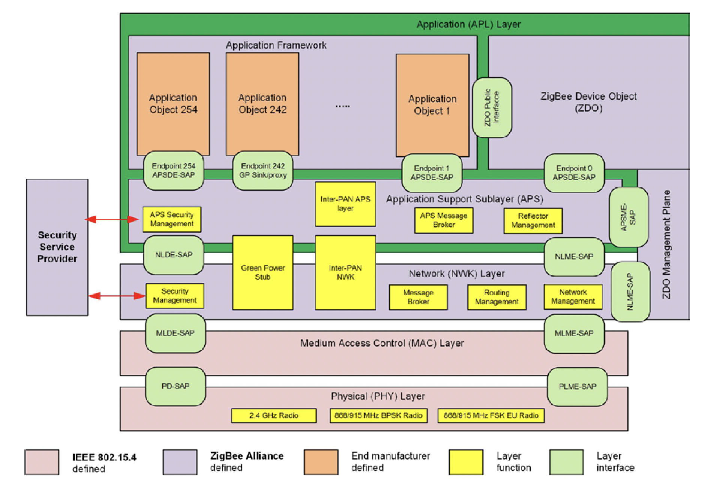

# zigbee

The ZigBee protocol stack** in `no_std` to integrate ZigBee communication into an application.

Zigbee is a wireless communication technology designed for low-power devices in smart homes and industrial settings. 
It enables these devices to connect and communicate with each other, allowing for efficient control and automation of various systems.

 
Outline of the ZigBee Stack Architecture

